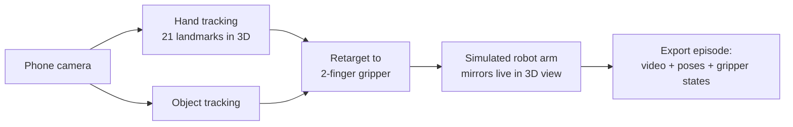
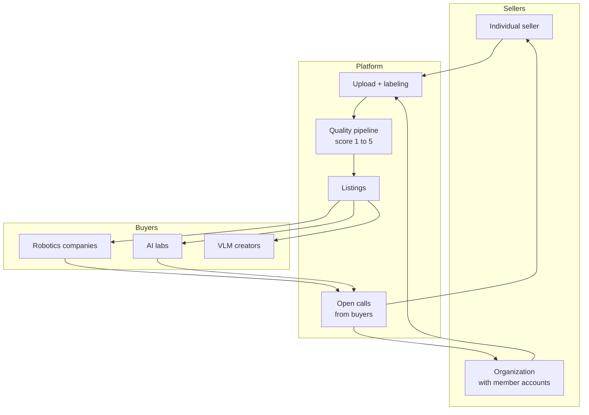
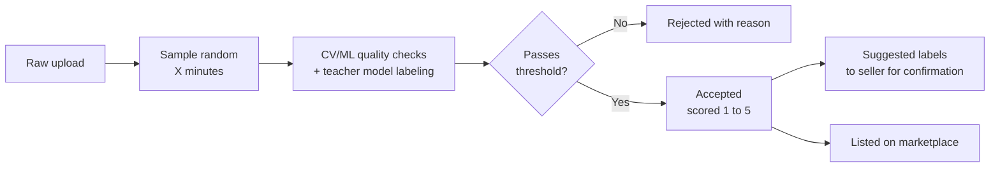

# Detailed Breakdown: Phone to Robot Training Data

## One-liner

Film yourself doing a task with your phone. The app tracks your hands and objects in 3D, a simulated robot arm mirrors you live on screen, and the recording is exported as robot training data you can sell on our marketplace.

## Why this wins

- Physical AI's biggest bottleneck is demonstration data. Everyone agrees on this.
- Anyone with a phone becomes a data collector. No lab, no teleoperation rig, no mocap suit.
- The demo moment: you wave your hand and a robot copies you instantly on screen.
- Two-sided win: passive income for individuals, real-world data at scale for robotics companies and AI labs.

## The two halves

| Half | What it is | Who sees it |
|------|-----------|-------------|
| Capture pipeline | Phone camera, 3D hand tracking, object tracking, live robot arm mirror, training data export | The wow demo on stage |
| Data marketplace | Sellers upload and label footage, quality pipeline scores it, buyers purchase in packages | The startup story |

---

## 1. Capture pipeline (the demo)

- Hand and finger tracking in 3D, in real time, from a single phone camera.
- Object tracking follows what the hand manipulates (cloth, cups).
- A simulated robot arm with a simple two-finger gripper mirrors the movement live.
- Recording exports as a training episode: synced video frames, hand poses, gripper open/close states, object positions, timestamps.

Known constraint: human hand to robot gripper mapping is approximate. We keep the arm simple (two-finger gripper) and sell the pipeline, not perfect retargeting.

---

## 2. Marketing angles

- Get paid more for what you already do. A mechanic keeps fixing cars as normal, just records it with the phone they already own.
- Anyone can register and sell: lawn mowing, house cleaning, cooking, car repair, sewing, any trade.
- Society-wide data collection to accelerate robotics and AI.
- For companies: access to real, daily, unstaged raw data of task completion, across all trades, from all around the world.
- Think "social media mechanics, but you get paid": record, upload, earn.

---

## 3. Marketplace

Two sides of one interface:

### Interfaces

- Desktop web app: full marketplace for both sides.
- Phone app: sellers record and upload straight from their gallery.

### Data sellers

- Sign up as an individual or as an organization (org members upload under the org).
- Upload footage, add labels and descriptions. More detail means higher quality score and higher payout.
- Browse open calls from buyers to see what data is in demand, and collect what pays most. Freelance data collection.

### Labels

| Label category | Examples |
|----------------|----------|
| Perspective | Egocentric (first person), exocentric (third person) |
| Task type | Folding, assembly, cleaning, cooking, repair |
| Industry | Automotive, domestic, food, textile, landscaping |
| Tools used | Vacuum cleaner, drill, frying pan, sewing machine |
| Recording device | Phone model, camera model, head-mounted camera |

Labels are user-entered plus auto-suggested: our quality model proposes labels it detects in the footage, the seller confirms or corrects them. This improves label coverage and payout at the same time.

### Open calls (demand side)

Buyers post open applications for specific data they need ("500 hours of egocentric kitchen footage with tongs"). Sellers browse these calls, see demand and pricing, and record to match. This steers supply toward what buyers actually want.

---

## 4. Quality pipeline

After upload, we run an automated pass over a randomly selected X minutes of the footage before accepting it.

Labeling loop: a teacher model generates or labels data, a student model trains on it, and production outcomes feed back to improve the next cycle.

### Quality indicators

| Indicator | What it checks |
|-----------|----------------|
| Format validity | Parses correctly, schema matches, no truncated outputs |
| Correctness | Agrees with ground truth where available, or passes rule-based checks |
| Consistency | Teacher gives the same answer on repeated or paraphrased inputs |
| Agreement | Multiple teacher samples or a judge model agree on the label |
| Confidence | Low-confidence or high-entropy outputs get flagged |
| Deduplication | Near-duplicates removed so the student does not overfit |
| Diversity/coverage | Batch covers the input distribution, not just easy cases |
| Safety filters | Toxic, leaked, or off-policy content excluded |
| Downstream signal | The real test: training on the batch improves student evals |

### System health signals

- Stable pass rates per batch.
- Human spot-check agreement with automated scores.
- Student eval improvements tracking the quality scores.
- A sudden pass-rate shift usually means teacher drift or a broken check, not better data.

---

## 5. Buyer packages and pricing

| Package | Contents | Relative price |
|---------|----------|----------------|
| Raw | Original footage only | Low |
| Processed | Labeled, scored, export-ready training data, no raw footage | Mid |
| Raw + processed | Both | High |

Seller payout scales with quality score (1 to 5) and label completeness.

---

## 6. How we differ from Figure AI

What Figure is doing (researched 2026-10-03, figures are Figure's own claims as reported, not independently verified):

- Project Go-Big (Sept 2025): pretrain Helix on egocentric human video, collected passively in Brookfield homes, offices and warehouses.
- Index (launched 2026-08-25): a phone app that pays people to film everyday tasks. Reported 16M+ videos, 108 countries, $15M paid out, which works out to about $0.94 per video.
- The data feeds Helix only. Nobody else can buy or download it.
- Content is household chores: tidying, folding, cleaning, navigation.
- Contributors get no published quality feedback and no skill-based pay.

Sources: [Figure, Project Go-Big](https://www.figure.ai/news/project-go-big), [explainx on Figure Index](https://explainx.ai/blog/figure-index-robot-dataset-august-2026), [Humanoids Daily](https://x.com/humanoidsdaily/status/2092317847645032776).

Where we go instead:

| | Figure Index | Us (Guild) | In the build |
|---|---|---|---|
| Content | Household chores | Skilled trades: welding, wiring, repair, tailoring, HVAC | Trade-first label set, seed data, open calls |
| Buyer | Figure only | Any lab or robotics company | Marketplace + open calls |
| Ownership | Figure keeps it | Seller keeps it, non-exclusive licence, earns on every sale | Licence note on listing, per-sale payout |
| Pay | About $1 per video, same for all | Scales with score, labels, and years in the trade (1x / 1.25x / 1.5x) | `tier()` and `payout()` in `lib/score.ts` |
| Provenance | Anonymous crowd | Trade, years, licence shown to buyers. Vision model also reads skill level from the footage | Register form, listing page |
| Feedback | Opaque, after upload | Live checks on the phone before upload, each with a fix | `lib/quality.ts`, upload form |
| Output | Video for one humanoid | Video + step list + hand-pose episode for any gripper | `/record` episode JSON |
| Privacy | Faces from real homes uploaded | Face and screen flags raised at review | `flags` in the vision review |

Why skilled labour is the right wedge: chores are what Figure already has 16M clips of. Expert trade work is rare, needs a real tradesperson, and is what industrial robotics buyers cannot collect themselves. A master electrician's hour is worth far more than a stranger folding a towel, and we pay like it.

Next steps that widen the gap (not built): verify licences against trade registries, step-level timestamps, per-buyer exclusivity windows at a premium, org accounts for workshops and vocational schools.

## 7. Mission: data democratization

Robot training data should not belong to one company. Figure collects from the crowd and keeps all of it for Helix. We do the opposite:

- The person who did the work owns the footage and licenses it, non-exclusively, as many times as it sells.
- Any lab, startup or university can buy on the same terms and the same public price.
- Prices, quality scores and the evidence behind every label are open to inspect.

Pitch line: "Figure built a pipeline into one robot. We built a market that every robot can buy from."

## 8. A live market for robot data (the StockX angle)

Each task (welding, wiring, repair...) is its own market, priced in USD per hour of footage.

| Piece | What it is in the app |
|-------|----------------------|
| Bids | Buyers' open calls: hours wanted at a rate per hour |
| Asks | Listings. Price follows the market unless the seller sets their own ask |
| Last sale | Rate of the most recent sale in that task |
| Sell now | Seller fills a matching bid in one tap, at the bid's rate |
| Price board | `/market`: rate, top bid, last sale, hours wanted, hours listed, signal |

Formula (in `lib/score.ts`, tested):

- Rate = average bid ($20/h if no bids) x (0.6 to 1.4, by hours wanted vs hours listed), then pulled 30% toward the last sale.
- Clip price = rate x length x score/4 x experience tier. Seller keeps 80%.
- The last sale is clamped to 0.5x..2x of the rate, so one odd trade or an inflated ask cannot move a market by more than 30%.

Why it is a marketing angle: the price is a signal. When wiring footage is scarce the rate goes up, electricians see it on their sell page and start filming. Supply follows what robots need. Sellers see why they are paid what they are paid.

Not built: real payments, binding escrow on bids, price history charts.

## 9. The evidence trail is the product

Every upload gets an append-only log (`events` table). It stores:

| Step | Who | What is stored |
|------|-----|----------------|
| Observed | Device | Measured metrics (resolution, light, sharpness, steadiness, hands), what the seller entered |
| Proposed | Model (Kimi) | Labels, steps, skill read, content score, reasons, flags, or the error if it did not run |
| Changed / kept | Reviewer (seller) | Field-by-field before and after, score before and after, and their note on why |
| Priced | Market | Score components and the market rate at that moment |
| Accepted / passed | Buyer | Package, price, the reasons they picked, and their note |

Where it shows: the listing page leads with the trail and a model-vs-reviewer agreement count. It ships inside the processed package. Each buyer gets a private acceptance profile on `/buy` (what they accept, at what score, for which reasons) and listings that fit it are marked.

Defensibility hypothesis: accumulated buyer-specific acceptance knowledge can eventually become more valuable than the annotation interface. Knowing that buyer X only takes egocentric wiring at score 4+ with terminations in focus lets us route, price and pre-filter for them in a way a new entrant cannot copy.

That advantage does not exist yet. Today the profile is a simple rule over a handful of events. It becomes real only with many buyers and many decisions. We say this plainly in the pitch.

## 10. Workers afraid of being replaced

We do not tell workers robots will not change their trade. That is not ours to promise and they would not believe it. The honest pitch: if your skill is going to train a robot anyway, be the one who gets paid for it, every time, on your terms.

| Fear | Our answer | In the build |
|------|-----------|--------------|
| "They take my skill once and I get nothing" | Royalty, not a fee. 80% of every licence, and one clip sells to many buyers | Per-sale payout, earnings on `/sell`, calculator on the landing page |
| "I lose control of it" | Worker owns the footage. Buyers get a licence. Withdraw any clip, any time | `Withdraw from the market` on each upload, logged on the trail |
| "Someone decides what I am worth behind my back" | Open prices, and the worker sees who bought and why | `/market`, evidence trail visible to the seller |
| "Anyone with a phone undercuts me" | Experience is priced in: 1.25x at 3 years, 1.5x at 10 | `tier()` |
| "This is extra work for me" | Each upload gives back a dated job record with steps and tools, for customers or apprentices | `Download job record` on the seller's listing |
| "I am filming my own replacement" | The worker picks what to film. Start with the repetitive or risky parts they would hand off first | Copy on landing and `/sell` |

Also lowers friction: the sell page and its live quality check work without an account, so a worker sees what their clip would earn before signing up.

Not built, worth saying in Q&A: a worker-owned data trust or co-op that negotiates as a bloc, licence terms that exclude named uses, pension-style payout of royalties.

## 11. Framing for business and finance judges

Lead with the market, not the app.

- What it is: an exchange for physical AI training data. Two-sided marketplace with price discovery.
- Revenue: 20% take rate on every licence.
- Why margins are good: supply has no capex (workers' own phones, on jobs they are already paid for), and licences are non-exclusive, so the same hour resells with no new cost.
- Demand signal: the bid book. Buyers post hours wanted and a rate before supply exists. The landing page shows its dollar value live.
- Unit economics: the landing page calculator shows gross licence value, worker royalty and platform revenue for one worker. It is arithmetic on current rates, not a forecast.
- Moat: buyer acceptance data from the evidence trail. Stated as a hypothesis, not a claim.
- Comparable: Figure spends its own capital to collect data for one model. We take a cut of a market that serves every model.

What we must not claim: market size numbers we have not sourced, real revenue, or real buyers. All figures in the demo come from seeded data and the page says so.

## 12. Hackathon scope vs startup scope

| Piece | Hackathon (build now) | Startup (talk about) |
|-------|----------------------|----------------------|
| Hand tracking | Live, in browser or phone | Multi-camera, depth, wearables |
| Robot arm | One simulated 2-finger gripper arm | Real arm fine-tuning, many morphologies |
| Export | One clean episode format | LeRobot/RLDS compatible datasets at scale |
| Marketplace | Working two-sided UI with demo data | Payments, contracts, org management |
| Quality pipeline | One automated pass with a VLM, score + suggested labels | Teacher-student loop with downstream eval feedback |
| Payouts | Shown in UI, not real money | Real payments per accepted hour |
