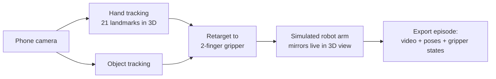
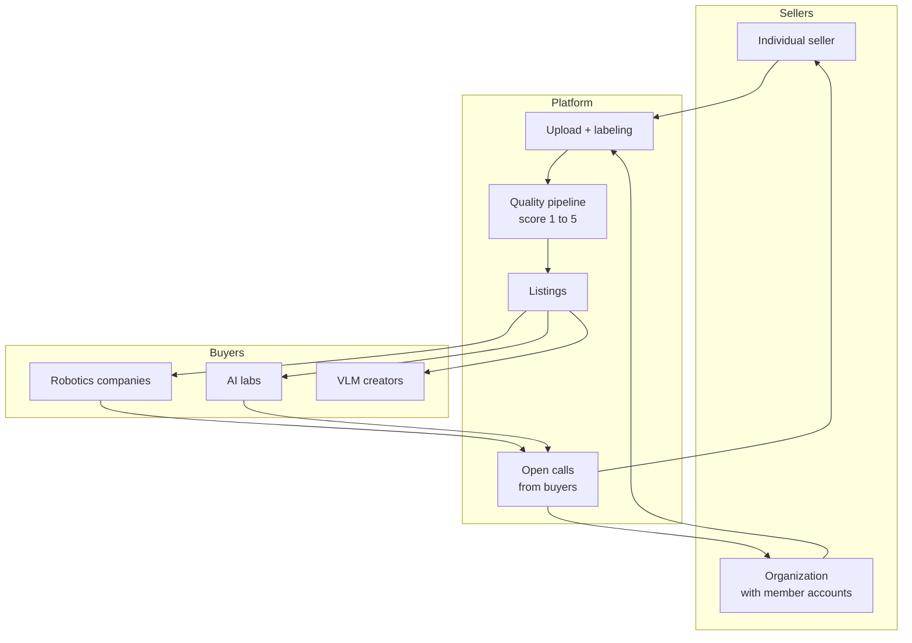
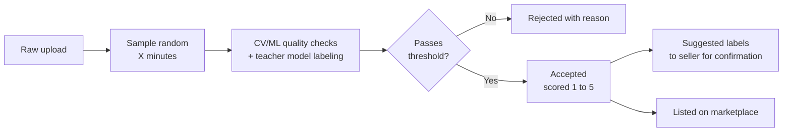

# Detailed Breakdown: Phone to Robot Training Data

## One-liner

Film yourself doing a task with your phone. The app tracks your hands and objects in 3D, a simulated robot arm mirrors you live on screen, and the recording is exported as robot training data you can sell on our marketplace.

## Why this wins

- Physical AI's biggest bottleneck is demonstration data. Everyone agrees on this.
- Anyone with a phone becomes a data collector. No lab, no teleoperation rig, no mocap suit.
- The demo moment: you wave your hand and a robot copies you instantly on screen.
- Two-sided win: passive income for individuals, real-world data at scale for robotics companies and AI labs.

## The two halves

| Half | What it is | Who sees it |
|------|-----------|-------------|
| Capture pipeline | Phone camera, 3D hand tracking, object tracking, live robot arm mirror, training data export | The wow demo on stage |
| Data marketplace | Sellers upload and label footage, quality pipeline scores it, buyers purchase in packages | The startup story |

---

## 1. Capture pipeline (the demo)

- Hand and finger tracking in 3D, in real time, from a single phone camera.
- Object tracking follows what the hand manipulates (cloth, cups).
- A simulated robot arm with a simple two-finger gripper mirrors the movement live.
- Recording exports as a training episode: synced video frames, hand poses, gripper open/close states, object positions, timestamps.

Known constraint: human hand to robot gripper mapping is approximate. We keep the arm simple (two-finger gripper) and sell the pipeline, not perfect retargeting.

---

## 2. Marketing angles

- Get paid more for what you already do. A mechanic keeps fixing cars as normal, just records it with the phone they already own.
- Anyone can register and sell: lawn mowing, house cleaning, cooking, car repair, sewing, any trade.
- Society-wide data collection to accelerate robotics and AI.
- For companies: access to real, daily, unstaged raw data of task completion, across all trades, from all around the world.
- Think "social media mechanics, but you get paid": record, upload, earn.

---

## 3. Marketplace

Two sides of one interface:

### Interfaces

- Desktop web app: full marketplace for both sides.
- Phone app: sellers record and upload straight from their gallery.

### Data sellers

- Sign up as an individual or as an organization (org members upload under the org).
- Upload footage, add labels and descriptions. More detail means higher quality score and higher payout.
- Browse open calls from buyers to see what data is in demand, and collect what pays most. Freelance data collection.

### Labels

| Label category | Examples |
|----------------|----------|
| Perspective | Egocentric (first person), exocentric (third person) |
| Task type | Folding, assembly, cleaning, cooking, repair |
| Industry | Automotive, domestic, food, textile, landscaping |
| Tools used | Vacuum cleaner, drill, frying pan, sewing machine |
| Recording device | Phone model, camera model, head-mounted camera |

Labels are user-entered plus auto-suggested: our quality model proposes labels it detects in the footage, the seller confirms or corrects them. This improves label coverage and payout at the same time.

### Open calls (demand side)

Buyers post open applications for specific data they need ("500 hours of egocentric kitchen footage with tongs"). Sellers browse these calls, see demand and pricing, and record to match. This steers supply toward what buyers actually want.

---

## 4. Quality pipeline

After upload, we run an automated pass over a randomly selected X minutes of the footage before accepting it.

Labeling loop: a teacher model generates or labels data, a student model trains on it, and production outcomes feed back to improve the next cycle.

### Quality indicators

| Indicator | What it checks |
|-----------|----------------|
| Format validity | Parses correctly, schema matches, no truncated outputs |
| Correctness | Agrees with ground truth where available, or passes rule-based checks |
| Consistency | Teacher gives the same answer on repeated or paraphrased inputs |
| Agreement | Multiple teacher samples or a judge model agree on the label |
| Confidence | Low-confidence or high-entropy outputs get flagged |
| Deduplication | Near-duplicates removed so the student does not overfit |
| Diversity/coverage | Batch covers the input distribution, not just easy cases |
| Safety filters | Toxic, leaked, or off-policy content excluded |
| Downstream signal | The real test: training on the batch improves student evals |

### System health signals

- Stable pass rates per batch.
- Human spot-check agreement with automated scores.
- Student eval improvements tracking the quality scores.
- A sudden pass-rate shift usually means teacher drift or a broken check, not better data.

---

## 5. Buyer packages and pricing

| Package | Contents | Relative price |
|---------|----------|----------------|
| Raw | Original footage only | Low |
| Processed | Labeled, scored, export-ready training data, no raw footage | Mid |
| Raw + processed | Both | High |

Seller payout scales with quality score (1 to 5) and label completeness.

---

## 6. Hackathon scope vs startup scope

| Piece | Hackathon (build now) | Startup (talk about) |
|-------|----------------------|----------------------|
| Hand tracking | Live, in browser or phone | Multi-camera, depth, wearables |
| Robot arm | One simulated 2-finger gripper arm | Real arm fine-tuning, many morphologies |
| Export | One clean episode format | LeRobot/RLDS compatible datasets at scale |
| Marketplace | Working two-sided UI with demo data | Payments, contracts, org management |
| Quality pipeline | One automated pass with a VLM, score + suggested labels | Teacher-student loop with downstream eval feedback |
| Payouts | Shown in UI, not real money | Real payments per accepted hour |
