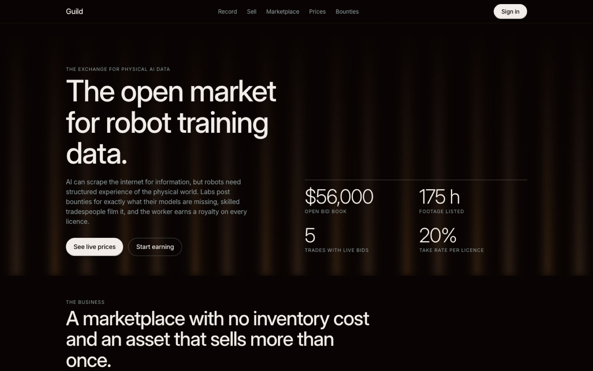
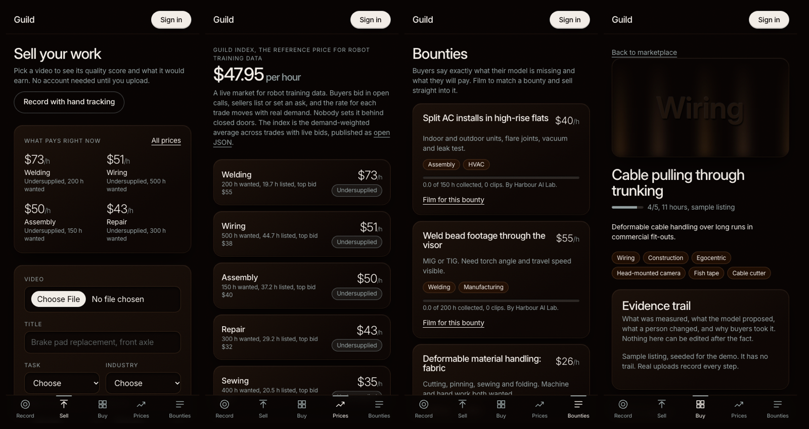
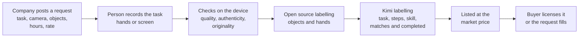
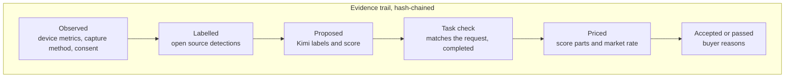
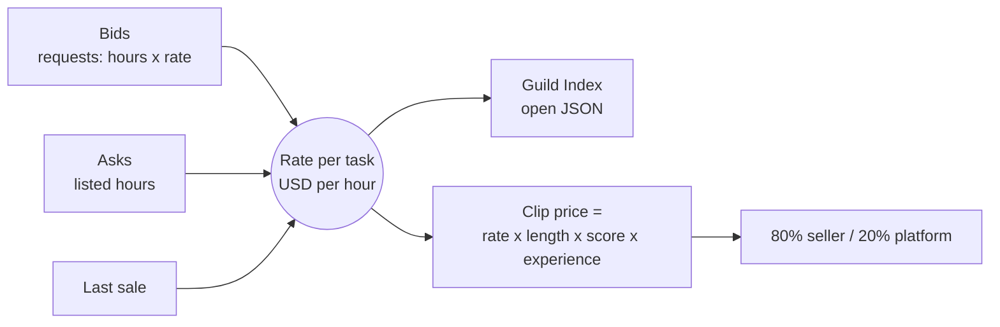

# Guild

**The open market for task data.**

AI companies can scrape the internet for information, but models that act need examples of people doing real tasks. Guild lets a company request the exact task examples its model is missing, and pays the people who record them. A recording can be hands filmed on a phone or a screen recording of a software task. The person who did the work keeps ownership and earns 80% of every licence.

Live demo: **https://guild-data.vercel.app** (on a phone: share menu, Add to Home Screen, and it runs like an app)

Built at the HK AI Summit hackathon. It is a working demo: no money moves, and listings marked Sample are seeded.





The screenshots are from an earlier build. The live site is the current design.

## Contents

- [What the demo shows](#what-the-demo-shows)
- [The problem](#the-problem)
- [How it works](#how-it-works)
- [AI in the pipeline](#ai-in-the-pipeline)
- [What makes it different](#what-makes-it-different)
- [Evidence of demand](#evidence-of-demand)
- [What is built](#what-is-built)
- [Pricing](#pricing)
- [Labelling options](#labelling-options)
- [What a buyer receives](#what-a-buyer-receives)
- [Trust: originality, provenance, licence](#trust-originality-provenance-licence)
- [For the people doing the work](#for-the-people-doing-the-work)
- [Run it](#run-it)
- [Known limits](#known-limits)

## What the demo shows

One journey:

1. A company posts a request: the task, the rate, what must be visible.
2. A person records it. Hands on a phone camera, tracked live, or a screen recording on a laptop.
3. The recording is processed on its own: quality, authenticity, originality, then two labelling systems.
4. Kimi names the task and says whether it matches the request and was completed.
5. A passing clip fills the request and is listed on the marketplace.

Navigation is four tabs: **Add data**, **Earn**, **Buy data**, **Profile**.

Recordings are not only physical work. A screen recording of a software task, such as building a pivot table in a spreadsheet, goes through the same pipeline and sells as a task example for automation.

Built but not part of the demo flow: forward contracts, result bonuses, the provenance certificate link and seller reputation. Their routes and data are still in the code.

## The problem

| What AI teams have today | Why it falls short |
|---|---|
| Scraped web video | Messy, unlabelled, unclear training rights, no sensor data, no failure cases |
| Their own collection teams | Slow and expensive: recruiting and managing thousands of collectors |
| Single-buyer crowd apps | Flat fee, household chores, data locked to one company |
| Staged teleoperation | Lab conditions, not how an expert actually works |

Models need the long tail: different workshops, tools, countries and software, and above all skilled work that only an experienced person can perform.

## How it works



Every step is written to an append-only evidence trail on the clip.



The market side works like an exchange, not a shop:



## AI in the pipeline

Two labelling systems run on every clip, and the report shows only what each one actually returned.

| System | Where it runs | What it returns |
|---|---|---|
| **Open source: MediaPipe** | In the browser, on the seller's device | Objects seen with confidence and frame counts, hand coverage and confidence. While filming: both hands, face mesh and body skeleton drawn live |
| **Kimi (`kimi-k2.6`)** | On the server, from six sampled frames | The task it sees, labels (task, industry, camera angle, tools), a step list, a skill read, a content score, privacy flags, and for a request: does this match, and was it completed |

How the task check decides a payout:

- Kimi says the clip is a different task, or the task was not completed: the request is not paid.
- Kimi did not run: the open source detector must have seen the objects the request names in at least two frames.
- A gallery upload can never fill a paid request, because it was not verified live.
- The clip must score 3 or more out of 5.

Tested on the live site: a photo of a plumber under a sink, submitted against the "Open and close a screw-top bottle" request, came back as "plumbing", not the requested task, and was not paid.

## What makes it different

| # | Idea | Status in this repo |
|---|---|---|
| 1 | **Own the price.** A reference rate per task, the Guild Index | Built. `/market` and open JSON at `/api/index` |
| 2 | **Verified capture.** Live hand tracking and a random finger challenge that cannot be filmed in advance | Built, required for paid requests |
| 3 | **Task check by a model.** The clip must be the requested task, and completed | Built with Kimi |
| 4 | **More than robotics.** Screen recordings of software tasks use the same pipeline | Built. Desktop browsers only |
| 5 | **Audit-ready provenance.** Consent, ownership, capture method and a hash-chained trail as a certificate | Built. `/api/provenance/[id]` |
| 6 | **Robot-neutral output.** State, action, next state, with no joint angles of any one robot | Built for in-app recordings. `guild-episode-v2` |
| 7 | **Pay on results.** A clip that improved the buyer's model earns the seller a 20% bonus | In the code, not in the demo flow. Self-reported |
| 8 | **Verified experts.** Licences checked, not just claimed | Partial. Manual check with `scripts/verify-seller.mjs` |
| 9 | **An exchange, not a vendor.** Labelling vendors and teleoperation farms sell staged collection as a service. We sell unstaged work on a market | Positioning |

Against scraping: original recordings, explicit training rights, known provenance, structured labels, requested environments and camera angles, failure cases, and a consistent format.

Against Figure's Index app: any buyer instead of one, a share of every sale instead of a flat fee, and the person keeps the data. See [DETAILED_BREAKDOWN.md](DETAILED_BREAKDOWN.md) section 6.

The moat we are aiming at is not the videos. It is the contributor network, rights-cleared provenance, reputation, and what we learn about what each buyer accepts. That last advantage does not exist yet. The app records the data that would build it.

### Competitive landscape

From the team's research in [UPDATED_BREAKDOWN.md](UPDATED_BREAKDOWN.md). Not re-verified here.

| Company | What they do | Difference to us |
|---|---|---|
| Figure Index | Gig platform, people film tasks | Data stays with Figure |
| DoorDash, Instawork, Sunain, Micro1 | Paid recording programs | Collect for specific clients, recruited workers |
| Scale AI, Encord | Data services and tooling | Enterprise, managed programs |
| Luel (YC W26) | Open marketplace, custom campaigns | Vetted contributors, mostly raw video |
| Kinetic Blocks | Humanoid data marketplace (beta) | Vetted suppliers only |
| Build AI | About 1M hours of free factory footage | Shows generic footage is a commodity |

Our combination: self-serve supply, open demand, phone or laptop only, and every recording checked, labelled and verified before it is listed. Human demonstration data complements robot data. It does not replace teleoperation.

## Evidence of demand

These are reported market figures, not ours. They come from a web search of industry roundups on 2026-10-03. We did not open every page to confirm which one carries which number, so check each figure against its link before quoting it on stage.

| Signal | Figure | Where to check |
|---|---|---|
| A robot maker is paying the public for video | Figure's Index app: 16M+ videos, 108 countries, $15M paid to contributors, $1B committed to data and compute | [explainx](https://explainx.ai/blog/figure-index-robot-dataset-august-2026), [Humanoids Daily](https://x.com/humanoidsdaily/status/2092317847645032776) |
| That works out to | About $0.94 per video, flat, for household tasks | Our arithmetic on the above |
| Capital is flowing into humanoids | $6.1B of venture funding across 139 deals in 2025 | [Humanoid market statistics roundup](https://cervo-tech.com/blog/humanoid-robot-market-statistics-2026.html) |
| Data collectors are scaling fast | Mecka reports about 160,000 hours a month and a roughly $100M run rate on signed contracts. Hub.xyz reports 540,000+ hours from 150 countries | [Robotics training data landscape](https://www.teahose.com/guides/robotics-training-data), [DreamVu landscape](https://www.dreamvu.ai/blog/robot-training-data-companies-2026) |
| Demand for the data is growing | Robot training data market reported up 200%+ in 2026 | [Where robot training data comes from](https://labelstud.io/learning-center/where-robot-training-data-comes-from-in-2026/) |
| The skill we want to capture is scarce | US manufacturing may need 3.8M workers by 2033, and 1.9M of those jobs could go unfilled | [Deloitte and The Manufacturing Institute](https://www.deloitte.com/us/en/insights/industry/manufacturing-industrial-products/manufacturing-industry-outlook/2025.html) |
| And it is retiring | Roughly five skilled workers retire for every two who enter | [Trades shortage summary](https://tradecolleges.org/blog/skilled-trades-outlook/skilled-trades-shortage-opportunity) |

What this shows: companies already pay for human demonstration data at scale, and the competitors doing it are closed pipelines or service vendors. What it does not show: that people will record their work, or that buyers will pay more for verified footage. Those are the two things to test first.

**Our own traction: none.** No real buyers, no real sellers, no revenue. The numbers on the live site come from seeded demo data and the page says so.

How we would start, given the cold-start problem: not as an open marketplace. Sign two or three buyers with specific requests first, then recruit sellers for exactly those through one trade school or workshop.

## What is built

| Page | Tab | What it does |
|---|---|---|
| `/` | | The pitch: a full-screen video hero, how it works in four posters (halftone style, a short label follows the cursor), an interactive cost chart, benefits for sellers and buyers, a scroll-driven 3D arm that picks up a glass mug on a workbench with data labels drawn over it, and the mission |
| `/record` | Add data | Pick a task (cup practice, two in-demand requests, or your own), then film. Both hands, face mesh and body skeleton drawn live in green, a virtual cup to pick up, quality warnings and a finger challenge |
| `/sell` | Earn | Three ways in: film your hands, record your screen, upload a video. Then earnings, listings, asks and withdrawals |
| `/sell/[id]` | Earn | Processing report for one clip: result, checks, both labelling systems, and the form to confirm labels and make it golden |
| `/calls` | Earn | Open requests. Search and filter by task, record for one, or submit a clip you already have. Buyers post requests here |
| `/buy` | Buy data | Marketplace grid with filters and tags |
| `/buy/[id]` | Buy data | Evidence trail, price breakdown, licence, labelling options, accept or pass with a reason |
| `/market` | Buy data | Guild Index and the price board per task |
| `/profile` | Profile | Seller: earnings this month and all time, a 30-day chart, earnings by task and recent sales. Buyer: the same for what they spent |
| `/login` | Profile | Email and password, seller or buyer |

API: `/api/upload` (the pipeline), `/api/blob` (video upload), `/api/check` (originality), `/api/index` (open price index), `/api/provenance/[id]` (certificate), `/api/dataset/[id]` (request owner's dataset manifest).

### How a recording is processed

A recording or upload is submitted automatically and runs to completion with a progress view.

1. **While recording.** Warnings appear live: hands out of frame, too dark, moving too fast.
2. **Authenticity.** See the table below. A clip that fails is stored but never listed.
3. **Quality, on the device.** Six sampled frames are scored for resolution, length, lighting, sharpness, steadiness and hands in frame. Screen recordings skip the hand checks.
4. **Originality.** A file fingerprint and a perceptual hash per frame are compared with every clip already submitted by anyone. A copy is saved but never listed or paid.
5. **Rights.** By adding a recording the seller confirms they made it, anyone identifiable agreed, and they grant the licence. The consent record is written to the trail.
6. **Open source labelling.** The MediaPipe object detector and hand tracker.
7. **Kimi labelling.** Task, labels, steps, skill, privacy flags and the task check.
8. **Score 1 to 5** from the technical checks, label completeness and Kimi's content score. Then the price.

### Authenticity: making fakes impractical

| Layer | How it works | Status |
|---|---|---|
| Challenge-response | A few seconds in, a random prompt ("show 3 fingers"). Checked against the live hand landmarks. Cannot be filmed in advance | Built, required for in-app recordings |
| Hand tracking stream | Landmarks from the session must cover the video | Built, required for in-app recordings |
| Motion sensor sync | Accelerometer and gyroscope recorded alongside the video | Built, recorded. Not required, since laptops have none |
| Duplicate detection | Perceptual hashing against our own catalog | Built. Not checked against footage elsewhere online |
| Payout holding period | 14 days, so fraud found later is never paid | Shown in the UI. No payments yet |
| Device attestation, C2PA | App Attest, Play Integrity, content credentials | Not built |

Gallery uploads go through the same quality and labelling steps, are listed as "not verified live", and cannot fill paid requests.

The episode file is produced in the browser, so a determined cheat can forge it. Attestation is what closes that gap.

### Two ways to earn

| | Requests | Open catalog |
|---|---|---|
| Who starts it | A buyer posts a request with a budget: task, number of demos, camera angle, objects that must be visible | A seller records any task |
| Payout | The request's rate, once the clip passes the checks and the task check | A share every time it sells, at the market price |
| Like | A freelance job | Stock footage |
| In the app | "Record for this request" opens the recorder. A passing clip is bought by the request automatically | Every clip is also listed in the catalog |

Licences are non-exclusive. Exclusive licences at a premium are not built.

### Data captured

| Captured now | Not captured |
|---|---|
| RGB video, timestamps, device type | Depth |
| Hand landmarks for both hands, per frame (in-app) | Audio (recorded without it on purpose) |
| Body pose, and the result of each challenge (in-app) | Camera pose |
| Accelerometer and gyroscope (in-app, where the phone allows) | Location |
| Screen video for software tasks | Clicks and keystrokes |
| Task, industry, tools, camera angle, steps, outcome | Object tracking across frames |

## Pricing

Each task is its own market, in USD per hour of footage.

- **Rate** = average bid ($5/h if none) x 0.6 to 1.4 by hours wanted against hours listed, then pulled 30% toward the last sale. The last sale is clamped so one odd trade cannot move a market more than 30%.
- **Clip price** = rate x length x score / 4 x experience tier (1x, 1.25x at 3 years, 1.5x at 10 years), in dollars and cents. There is no per-clip minimum: a one-minute clip is worth cents, the same per hour as a long one.
- **Golden clips** list 30% higher.
- **Split**: 80% to the seller, 20% to the platform. Licences are non-exclusive, so one clip can sell many times.

Common footage gets cheaper, rare footage gets dearer, and sellers see what pays most right now. All of it is in `lib/score.ts` and covered by tests.

### What the market pays today

Reported figures from a web search on 2026-10-04, not verified at source by us. They are why the demo's rates sit between 5 and 16 USD per hour of footage, and why clips are priced in cents.

| What | Reported range | Where to check |
|---|---|---|
| Raw egocentric video, cost to the buyer | 15 to 22 USD per hour | [Dexset pricing guide](https://dexset.ai/blogs/robot-training-data-costs-pricing-complete-2026/) |
| Annotated egocentric video | 30 to 40 USD per hour | [Dexset pricing guide](https://dexset.ai/blogs/robot-training-data-costs-pricing-complete-2026/) |
| Teleoperated robot data | 28 to 60 USD per hour, 80 to 150 for complex humanoid programs | [Dexset](https://dexset.ai/blogs/robot-training-data-costs-pricing-complete-2026/), [DataXPower](https://www.dataxpower.com/blog/humanoid-robot-data-collection-cost) |
| What contributors are paid | Mostly 3 to 9 USD per hour of accepted footage, as low as 1, up to 15 to 30 for some US roles | [TechCrunch](https://techcrunch.com/2026/05/26/human-archive-taps-into-indias-services-startups-to-collect-data-for-physical-ai/), [Remowork roundup](https://remowork.life/blog/get-paid-to-record-household-chores-egocentric-ai-data-platforms-2026) |

Our rates are at the low end of what buyers pay elsewhere, and a seller's 80% share lands inside the range contributors earn today. The difference is that a Guild clip can sell more than once.

## Labelling options

A buyer always pays for the raw data. Labelling is a separate line they choose per clip:

| Option | Cost | What they get |
|---|---|---|
| Bring your own labelling | Free | The recording, the episode file and motion data, plus the open source detections |
| LLM labelling (Kimi) | +15% | Task, step list, skill level and privacy flags from a vision language model |
| Guild verified | +60% | Model labels checked by a person, field by field |

An option is only sold when its labels exist for that clip: LLM labelling needs the Kimi review to have run, and Guild verified needs a golden clip.

**Golden clips.** On the processing report the seller checks each label against what they recorded and confirms it. The clip becomes golden, lists 30% higher, and unlocks the Guild verified option. The correction is written to the evidence trail.

### Open source video labelling tools we looked at

| Project | Licence | What it is | Why it is or is not in the build |
|---|---|---|---|
| [MediaPipe](https://github.com/google-ai-edge/mediapipe) | Apache 2.0 | On-device vision models and runtime | Used. Small enough to run on a phone, so labelling is free and instant |
| [Label Studio](https://github.com/HumanSignal/label-studio) | Apache 2.0 | Multi-type annotation platform | Not hosted by us |
| [CVAT](https://github.com/cvat-ai/cvat) | MIT | The reference tool for video and object tracking annotation | Needs its own server. The natural home for a human review queue later |
| SAM 2, Grounded-SAM-2 | Apache 2.0 | Segmentation and tracking across video | Needs a GPU server. The next step for per-object masks |

Licence and usage notes for CVAT and Label Studio are from the projects' own pages and [this comparison](https://www.cvat.ai/resources/blog/best-open-source-data-annotation-tools).

## What a buyer receives

Not a folder of videos. For each request, the owner downloads a manifest with:

- video and episode links
- labels, step list, skill read, privacy flags
- capture metrics and contributor credentials
- licence terms
- a link to each clip's provenance certificate
- a fixed 80/10/10 train, validation and test split

Buyers can state where their model is weak when posting a request ("cable routing 51%"), so collection targets the gap.

## Trust: originality, provenance, licence

**Provenance certificate.** One JSON document per clip: file fingerprint, capture method, on-device measurements, originality result, contributor credentials and their verification status, the consent declaration, the licence, and the full trail. Each trail event carries a hash of the previous one, and the certificate reports whether the chain is intact. Buyers' private reasons are left out.

**Licence (Guild training licence v1).**

- The contributor keeps ownership of the footage.
- Non-exclusive: the same clip can be licensed to other buyers.
- The buyer may train and evaluate commercial AI models on it.
- The buyer may not resell, sublicense or publish the footage itself.
- Not licensed for surveillance, biometric identification, or generating likenesses of the people shown.
- Perpetual for models already trained. If the contributor withdraws the clip, no new licences are sold.

This is a demo licence written by us, not reviewed by a lawyer.

**Reputation.** Each seller has a score out of 100 from buyer acceptance rate, originality, and number of listed clips.

## For the people doing the work

We do not promise AI will not change a job. We make sure that if a person's skill trains a model, they are paid every time and stay in control.

- A share of every licence, not a one-off fee
- Withdraw any clip from the market at any time
- See who bought it and why
- Experience prices higher
- A dated record with steps and tools for each recording

More in [DETAILED_BREAKDOWN.md](DETAILED_BREAKDOWN.md) section 10.

## Run it

```sh
pnpm install
vercel link
vercel env pull .env.local                        # DATABASE_URL, BLOB_READ_WRITE_TOKEN, KIMI_API_KEY
node --env-file=.env.local scripts/init-db.mjs    # tables and demo data, safe to rerun
pnpm dev
```

| Variable | Needed | Notes |
|---|---|---|
| `DATABASE_URL` | yes | Set by the Neon integration |
| `BLOB_READ_WRITE_TOKEN` | yes | Set by the Blob store |
| `KIMI_API_KEY` | for Kimi labelling | A Moonshot key. Without it clips are scored on the technical checks and open source labels only |
| `KIMI_MODEL`, `KIMI_BASE_URL` | no | Default `kimi-k2.6` on `https://api.moonshot.ai/v1` |
| `KIMI_THINKING` | no | Set to `1` to turn on Kimi's reasoning mode. Slower: about 15 seconds instead of 2 |

Keep secrets in Vercel (`vercel env add`). `vercel env pull` overwrites `.env.local`, so a key that only lives in that file is lost.

- Tests: `pnpm test` (scoring, pricing, duplicate check, request matching, reputation)
- Mark a seller's licence as checked: `node --env-file=.env.local scripts/verify-seller.mjs seller@example.com`
- Demo seller with a month of sales (Mr. Wong, electrician, `wong@guild.demo`): `node --env-file=.env.local scripts/seed-wong.mjs <password>`. Sample data, safe to rerun
- Deploy: `vercel --prod`

**Stack:** Next.js 16, React 19, Tailwind 4, Vercel, Neon Postgres, Vercel Blob, MediaPipe (hands, face, pose, objects) in the browser, three.js, GSAP and Lenis for the landing page, Kimi (Moonshot) vision API.

```
app/            pages, server actions (actions.ts), API routes (api/)
components/     Recorder, SellStart, UploadForm, ClipStats, ArmScene, CostChart, Dither, Benefits, Tabs, Glyph
lib/score.ts    scoring, pricing, hashing, matching, reputation. Pure, shared by browser and server
lib/quality.ts  in-browser frame analysis and the MediaPipe models
lib/arm.ts      the 3D arm, mug and workbench
lib/server.ts   database, sessions, market query, evidence log
scripts/        init-db.mjs, verify-seller.mjs, seed-wong.mjs
docs/           README screenshots
```

## Known limits

- Kimi judges six still frames, not the whole video, so "completed" is often "unclear" on a short or static clip. Its reasoning mode is off by default for speed.
- The task check has been tested on a small number of clips. It has not been tuned or measured for accuracy.
- The open source detector knows 80 everyday objects. It does not know cloth or trade tools.
- Quality metrics, detections and duplicate hashes are computed in the seller's browser and can be spoofed.
- The duplicate check misses trimmed or mirrored copies. There is no manual review queue.
- Authenticity checks raise the cost of faking, they do not make it impossible. No device attestation or C2PA signing.
- The finger challenge uses a simple landmark rule and has not been tuned on many hands.
- Screen recording works in desktop browsers only, and has no authenticity check beyond the duplicate check.
- "Guild verified" today means the seller checked their own labels, not an independent reviewer.
- Request diversity (minimum number of different people) is shown, not enforced.
- No blurring of faces, plates, screens or documents. Kimi only flags them.
- A person can record things they do not own: an employer's process, a customer's property, confidential data on a screen. Consent is a declaration, not a check.
- Experience, trade and licence are self-declared unless manually verified.
- Video files sit on unguessable but public URLs.
- No payments, no password reset, no login rate limit.
- The hero image and video are third-party and should be replaced before any public use.
- The labels drawn over the 3D arm on the landing page (joint angles, "mug 0.97") are an illustration of labelling, not model output.
- Short clips are worth cents at these rates. Whether sellers will record for that, without a request paying a guaranteed rate, is untested.

## Photo credits

Sample listings use stand-in photos from Wikimedia Commons (public domain and CC BY / CC BY-SA). Authors, licences and source links are in [public/tasks/CREDITS.md](public/tasks/CREDITS.md). `wiring.jpg` was supplied by the team and its source is not recorded.
