# Guild

**The open market for task data.**

Companies post the tasks their AI needs to learn. People record themselves doing them: hands on a phone or laptop camera, or a screen recording of a software task. Every recording is checked, labelled and listed with a training licence. The person who did the work keeps ownership and earns 80% each time it is licensed.

Live demo: **https://guild-data.vercel.app**

Built at the HK AI Summit hackathon. It is a working demo: no money moves, and sample listings and sample sellers are seeded.

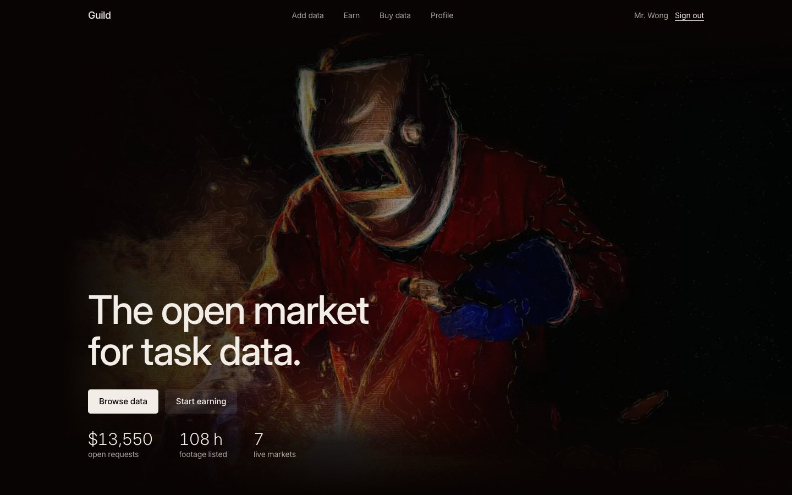

| | |
|---|---|
| 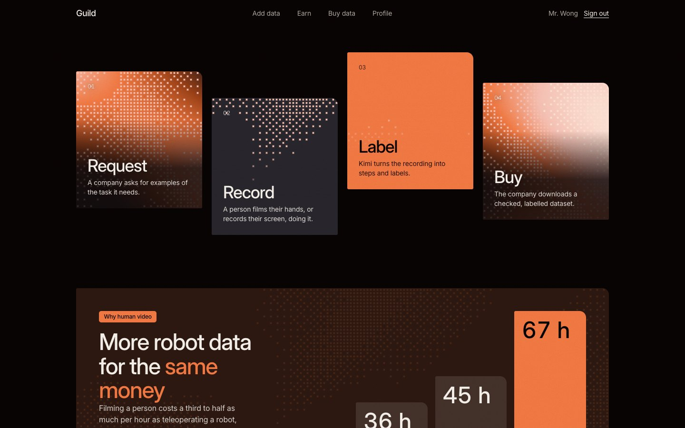 | 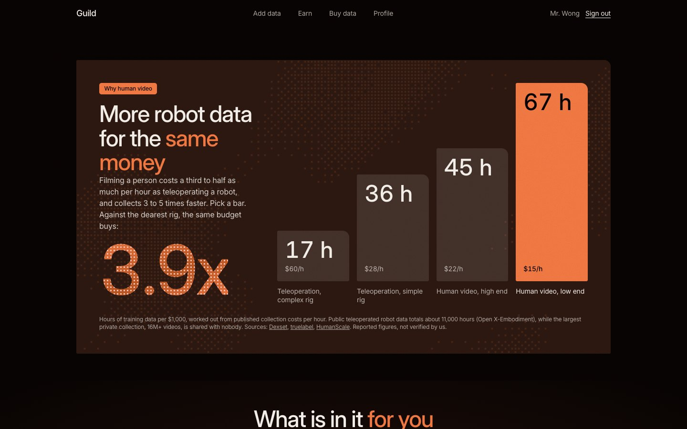 |
| 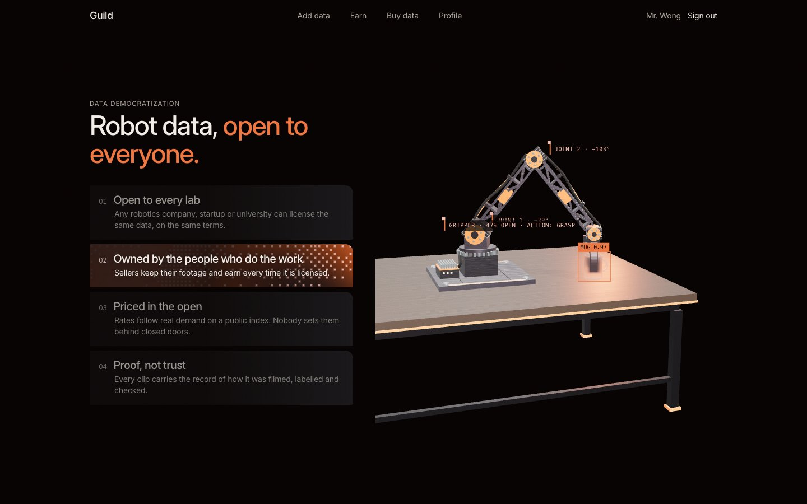 | 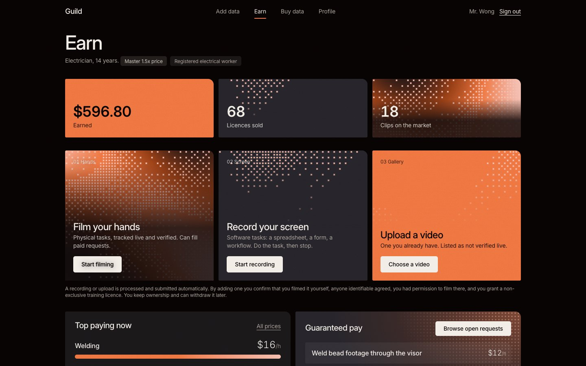 |
| 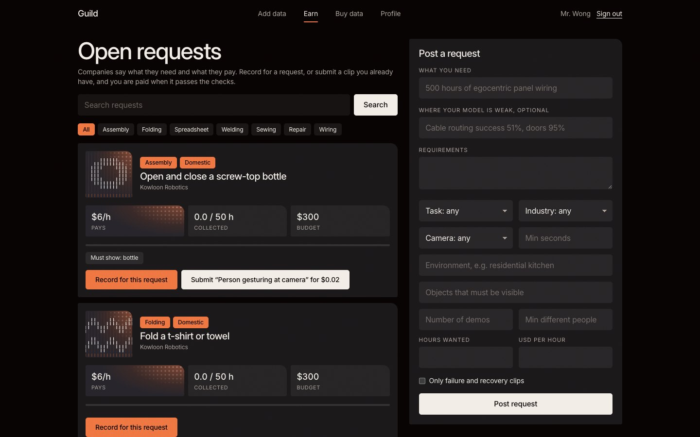 | 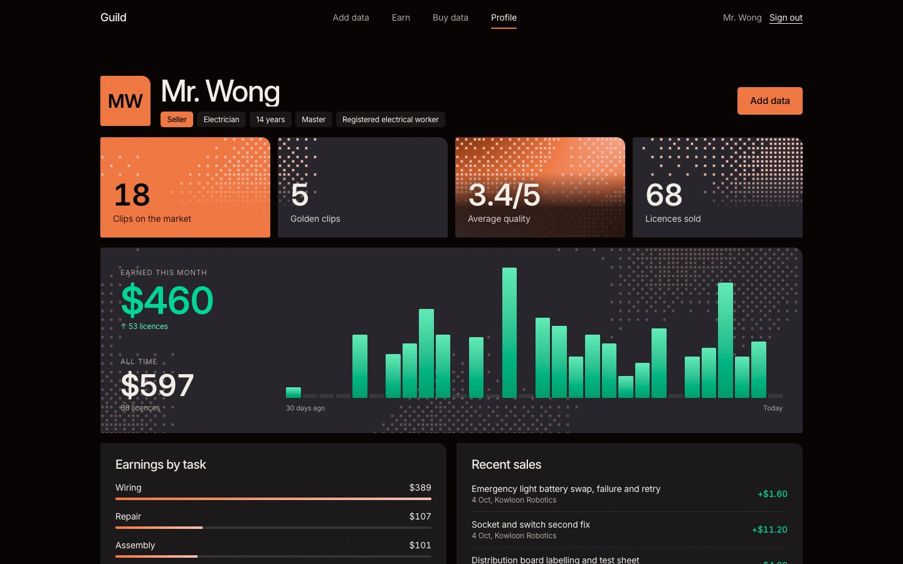 |

On a phone it installs from the browser (share menu, Add to Home Screen) and runs like an app:

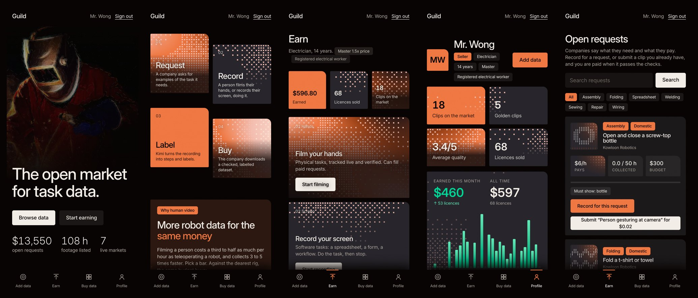

## Contents

- [What it does](#what-it-does)
- [Data processing pipeline](#data-processing-pipeline)
- [Pricing](#pricing)
- [Pages and API](#pages-and-api)
- [Architecture](#architecture)
- [Run it](#run-it)
- [Project structure](#project-structure)
- [Known limits](#known-limits)
- [Credits and licence](#credits-and-licence)

## What it does

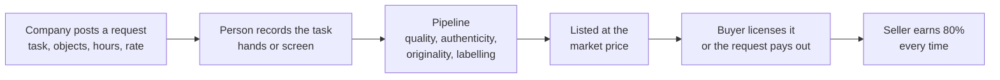

- **Two ways to earn.** Record for a request and be paid its rate when the clip passes, or record anything and earn a share each time it sells.
- **Three ways to add data.** Film your hands in the app (verified live), record your screen (desktop browsers), or upload an existing video (listed as not verified, cannot fill a paid request).
- **Your hand drives a robot arm.** In the recorder, hand tracking moves a 3D arm that can pick up a cup. The recording is stored as state, action and next state, not only as video.
- **Proof on every clip.** Each step of processing is written to an append-only, hash-chained trail that a buyer can read.
- **Open prices.** One hourly rate per task, moved by open requests against listed supply, published as JSON.

## Data processing pipeline

A recording is submitted automatically when it stops, and runs to completion with a progress view. Most of the work happens in the browser, so labelling costs nothing to offer and nothing leaves the device until the seller submits.

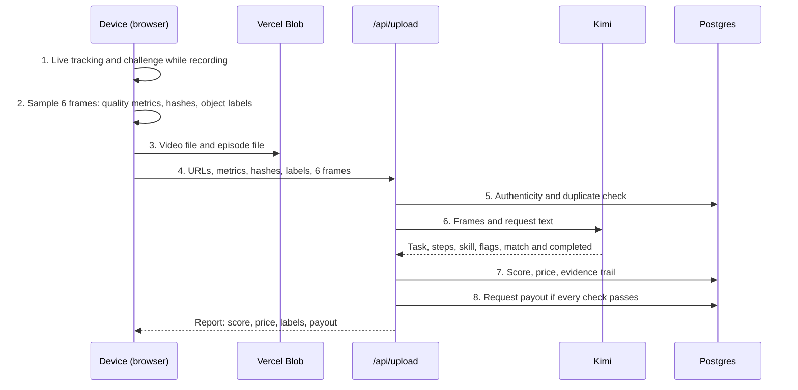

| # | Stage | Where | What it does | Code |
|---|---|---|---|---|
| 1 | Live capture | Browser | MediaPipe tracks both hands (21 landmarks each), face mesh and body pose at camera rate. Warnings show while filming: hands out of frame, too dark, moving too fast. A random "show N fingers" challenge is checked against the hand landmarks. Phone motion sensors are logged alongside | `components/Recorder.tsx` |
| 2 | Frame analysis | Browser | Six frames are sampled across the clip. Measured: resolution, length, brightness, sharpness, camera shake, share of frames with hands. An object detector (EfficientDet-Lite0, 80 everyday objects) labels each frame. A SHA-256 fingerprint of the file and a 64-bit difference hash per frame are computed | `lib/quality.ts` |
| 3 | Upload | Browser to Blob | The video and the episode file go straight to storage with a short-lived client token | `app/api/blob` |
| 4 | Submit | Browser to server | The server receives URLs, metrics, hashes, open source labels and the six frames as JPEG | `app/api/upload` |
| 5a | Authenticity | Server | For in-app recordings: the tracking stream must cover the video (at least 30% of 10 tracked frames per second) and every challenge must be passed. A clip that fails is stored but never listed | `authenticity()` in `lib/score.ts` |
| 5b | Originality | Server | Exact copies match on the fingerprint. Re-encoded copies match when two thirds of the frame hashes are within 10 of 64 bits. A copy is stored but never listed or paid | `nearDuplicate()` in `lib/score.ts` |
| 6 | Language model | Server to Kimi | `kimi-k2.6` sees the six frames and returns: the task it sees, labels (task, industry, camera angle, tools), a step list, a skill read, a content score from 1 to 5, privacy flags, and for a request whether the clip matches it and was completed | `review()` in `app/api/upload` |
| 7 | Score and price | Server | Score 1 to 5 from the technical checks (40%), label completeness (20%) and Kimi's content score (40%). Without Kimi: 60% technical, 40% completeness. Price follows from the task's market rate | `finalScore()`, `listPrice()` |
| 8 | Request payout | Server | Paid only if: recorded in the app, Kimi does not say "different task" or "not completed", the score is 3 or more, and the labels match the request. If Kimi did not run, the object detector must have seen the objects the request names | `app/api/upload` |

### Two labelling systems

The report shows only what each system actually returned.

| System | Runs | Returns |
|---|---|---|
| **Open source: MediaPipe** | On the seller's device | Objects with confidence and frame counts, hand coverage and confidence |
| **Kimi (`kimi-k2.6`)** | On the server, from six frames | Task, labels, steps, skill, content score, privacy flags, and the task check for requests |

### Authenticity

| Layer | How it works | Status |
|---|---|---|
| Challenge and response | A few seconds in, a random prompt ("show 3 fingers"), checked against live landmarks. Cannot be filmed in advance | Built, required for in-app recordings |
| Hand tracking stream | Landmarks from the session must cover the video | Built, required for in-app recordings |
| Motion sensors | Accelerometer and gyroscope logged with the video | Built, recorded. Not required, since laptops have none |
| Duplicate detection | Fingerprint and perceptual hashes against everything on the platform | Built. Not checked against footage elsewhere online |
| Device attestation, C2PA | App Attest, Play Integrity, content credentials | Not built |

### What is stored for a clip

- **Video** and, for in-app recordings, an **episode file** (`guild-episode-v2`): per-frame hand landmarks for both hands, body pose, gripper pose with the action to the next frame, motion sensor traces, and the challenge result. No joint angles of any one robot, so it is not tied to one machine.
- **Labels**: the seller's own, the open source detections, and Kimi's.
- **Evidence trail**: one event per step (`observed`, `labelled`, `proposed`, `task_check`, `priced`, `accepted`, and `duplicate` or `unverified` when a clip is refused). Each event stores a SHA-256 hash that covers the event before it, so an edited or deleted event breaks the chain. `/api/provenance/[id]` returns the trail as one certificate and reports whether the chain is intact.

## Pricing

Each task is its own market, in USD per hour of footage.

- **Rate** = average bid from open requests ($5/h if none) x 0.6 to 1.4 by hours wanted against hours listed, then pulled 30% toward the last sale. The last sale is clamped so one odd trade cannot move a market far.
- **Clip price** = rate x length x score / 4 x experience (1x, 1.25x at 3 years, 1.5x at 10 years), in dollars and cents. No per-clip minimum: a one-minute clip is worth cents.
- **Golden clips**, whose labels the seller checked by hand, list 30% higher.
- **Split**: 80% to the seller, 20% to the platform. Licences are non-exclusive, so a clip can sell many times.
- **Labelling** is a separate line the buyer picks per clip: bring your own (free), Kimi's labels (+15%), or human-checked (+60%).

The rates, the split and the labelling fees are our own choices for the demo. Nobody has paid them.

### What the market reports

Figures from a web search on 2026-10-04, read from search summaries and not verified at source.

| What | Reported range | Where to check |
|---|---|---|
| Raw first-person video, cost to the buyer | 15 to 22 USD per hour | [Dexset pricing guide](https://dexset.ai/blogs/robot-training-data-costs-pricing-complete-2026/) |
| Annotated first-person video | 30 to 40 USD per hour | [Dexset pricing guide](https://dexset.ai/blogs/robot-training-data-costs-pricing-complete-2026/) |
| Teleoperated robot data | 28 to 60 USD per hour, 80 to 150 for complex humanoid programs | [Dexset](https://dexset.ai/blogs/robot-training-data-costs-pricing-complete-2026/), [DataXPower](https://www.dataxpower.com/blog/humanoid-robot-data-collection-cost) |
| What contributors are paid | Mostly 3 to 9 USD per hour of accepted footage | [TechCrunch](https://techcrunch.com/2026/05/26/human-archive-taps-into-indias-services-startups-to-collect-data-for-physical-ai/), [Remowork roundup](https://remowork.life/blog/get-paid-to-record-household-chores-egocentric-ai-data-platforms-2026) |

The demo's rates ($5 to $16 per hour) sit at the low end of what buyers reportedly pay, and a seller's 80% lands inside what contributors reportedly earn.

## Pages and API

| Page | Tab | What it does |
|---|---|---|
| `/` | | Full-screen video hero, four posters for how it works, an interactive cost chart, benefits for sellers and buyers, a scroll-driven 3D arm that picks up a glass mug |
| `/record` | Add data | Pick a task, then film. Hands, face and body tracked live, a robot arm that mirrors your hand, live warnings, the finger challenge |
| `/sell` | Earn | Three ways to add data, top-paying tasks, open requests, your uploads with price and ask |
| `/sell/[id]` | Earn | Processing report for one clip, and the form to confirm labels and make it golden |
| `/calls` | Earn | Open requests: search, filter, record for one, or submit a clip you already have. Buyers post requests here |
| `/buy` | Buy data | Marketplace with filters and tags |
| `/buy/[id]` | Buy data | Evidence trail, price breakdown, licence, labelling options |
| `/market` | Buy data | The Guild Index and the price board per task |
| `/profile` | Profile | Earnings this month and all time, a 30-day chart, earnings by task, recent sales |
| `/login` | Profile | Email and password, seller or buyer |

| Endpoint | What it returns |
|---|---|
| `POST /api/upload` | Runs the pipeline for one recording |
| `POST /api/blob` | Client upload token for the video |
| `POST /api/check` | Originality check before submitting |
| `GET /api/index` | The open price index, as JSON |
| `GET /api/provenance/[id]` | Provenance certificate for a clip |
| `GET /api/dataset/[id]` | Dataset manifest for a request's owner, with a fixed 80/10/10 split |

## Architecture

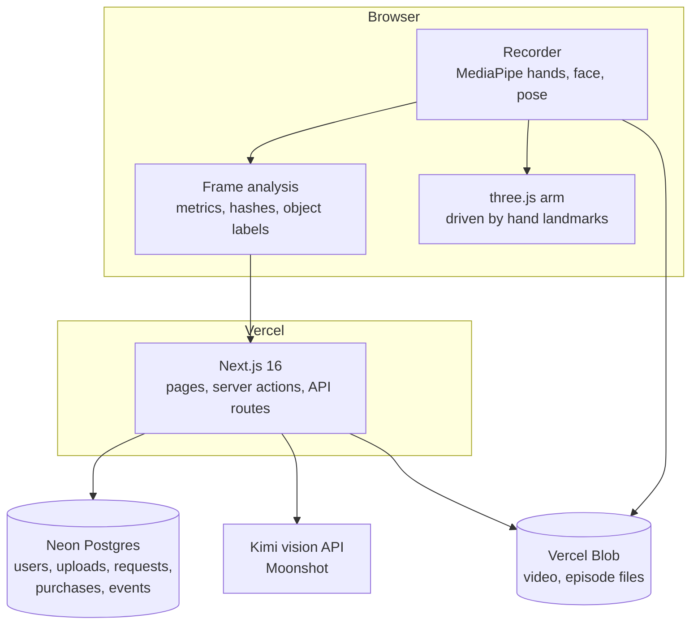

**Stack:** Next.js 16, React 19, Tailwind 4, Vercel, Neon Postgres, Vercel Blob, MediaPipe tasks-vision, three.js, GSAP and Lenis, Kimi (Moonshot) vision API. Sign-in is the app's own: scrypt password hashes and a session cookie.

## Run it

```sh
pnpm install
vercel link
vercel env pull .env.local                        # DATABASE_URL, BLOB_READ_WRITE_TOKEN, KIMI_API_KEY
node --env-file=.env.local scripts/init-db.mjs    # tables and sample data, safe to rerun
pnpm dev
```

| Variable | Needed | Notes |
|---|---|---|
| `DATABASE_URL` | yes | A Neon Postgres connection string |
| `BLOB_READ_WRITE_TOKEN` | yes | A Vercel Blob store token |
| `KIMI_API_KEY` | for Kimi labelling | A Moonshot key. Without it clips are scored on the technical checks and open source labels only |
| `KIMI_MODEL`, `KIMI_BASE_URL` | no | Default `kimi-k2.6` on `https://api.moonshot.ai/v1` |
| `KIMI_THINKING` | no | Set to `1` to turn on Kimi's reasoning mode. Slower: about 15 seconds instead of 2 |

Keep secrets in Vercel (`vercel env add`). `vercel env pull` overwrites `.env.local`.

- **Tests:** `pnpm test` (scoring, pricing, duplicate check, request matching, reputation, finger counting)
- **Sample seller with a month of sales:** `node --env-file=.env.local scripts/seed-wong.mjs <password>`
- **Mark a seller's licence as checked:** `node --env-file=.env.local scripts/verify-seller.mjs seller@example.com`
- **Deploy:** `vercel --prod`

## Project structure

```
app/
  page.tsx            landing page
  record/ sell/ calls/ buy/ market/ profile/ login/
  api/                upload (the pipeline), blob, check, index, provenance, dataset
  actions.ts          server actions: sign-in, requests, asks, purchases, golden clips
components/
  Recorder.tsx        camera, live tracking, challenge, robot arm
  UploadForm.tsx      progress view for the pipeline
  ClipStats.tsx       result, checks and both labelling systems for one clip
  ArmScene.tsx        scroll-driven 3D scene on the landing page
  Dither.tsx          the halftone poster background
  CostChart.tsx  Benefits.tsx  SellStart.tsx  Calculator.tsx  Tabs.tsx  Glyph.tsx
lib/
  score.ts            scoring, pricing, hashing, matching, authenticity. Pure, shared by browser and server
  score.test.mjs      tests for the above
  quality.ts          in-browser frame analysis and the MediaPipe models
  arm.ts              the 3D arm, mug and workbench, built from primitives
  server.ts           database, sessions, market query, evidence log
scripts/              init-db.mjs, seed-wong.mjs, verify-seller.mjs
docs/                 README screenshots
```

## Known limits

- **No traction.** No real buyers, sellers or revenue. Listings marked Sample and the sample sellers are seeded.
- **No payments.** Amounts shown are what recorded sales would pay. The 14-day payout hold is shown, not enforced.
- **Kimi sees six still frames**, not the video, so "completed" is often "unclear" on a short clip. The task check has been tried on a handful of clips and its accuracy is not measured.
- **The open source detector knows 80 everyday objects.** It does not know cloth or trade tools.
- **Browser-side checks can be spoofed.** Quality metrics, detections, hashes and the episode file are produced on the seller's device. The checks raise the cost of faking, they do not make it impossible.
- **The duplicate check misses trimmed or mirrored copies**, and does not look at footage elsewhere online.
- **The finger challenge uses a simple landmark rule** and has not been tuned on many hands.
- **Screen recording** works in desktop browsers only and has no authenticity check beyond the duplicate check.
- **"Human-checked" labels** today means the seller checked their own, not an independent reviewer.
- **Consent is a declaration, not a check.** A person can record an employer's process, a customer's property or confidential data on a screen. Faces are flagged by Kimi, not blurred.
- **Experience and credentials are self-declared** unless manually verified.
- **Video files sit on unguessable but public URLs.**
- **No password reset and no login rate limit.**
- **The licence text shown to buyers is a demo**, not reviewed by a lawyer.
- **The labels drawn over the 3D arm on the landing page** are an illustration, not model output.

## Credits and licence

The code is released under the [MIT License](LICENSE).

Third-party material is not covered by that licence:

- Sample listing photos are from Wikimedia Commons (public domain and CC BY / CC BY-SA). Authors, licences and links are in [public/tasks/CREDITS.md](public/tasks/CREDITS.md). `wiring.jpg` was supplied by the team and its source is not recorded.
- The hero video and its poster image are third-party and should be replaced before any commercial use.
- MediaPipe models are Apache 2.0, from Google.
