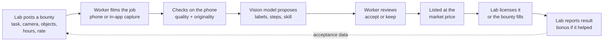
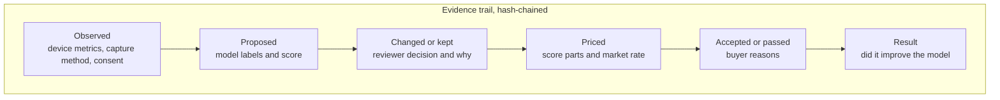
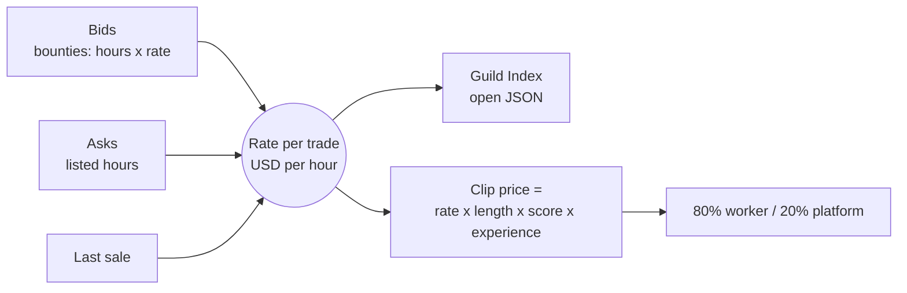

# Guild

**The open market for robot training data.**

AI companies can scrape the internet for information, but robots need structured experience of the physical world. Guild lets robotics labs request the exact real-world experience their models are missing, and pays skilled tradespeople to film it. The worker keeps ownership and earns a royalty on every licence.

Live demo: **https://guild-data.vercel.app** (on a phone: share menu, Add to Home Screen, and it runs like an app)

Built at the HK AI Summit hackathon. It is a working demo: no money moves, and listings marked Sample are seeded.


## Contents

- [The problem](#the-problem)
- [How it works](#how-it-works)
- [What makes it different](#what-makes-it-different)
- [Evidence of demand](#evidence-of-demand)
- [What is built](#what-is-built)
- [Pricing](#pricing)
- [What a buyer receives](#what-a-buyer-receives)
- [Trust: originality, provenance, licence](#trust-originality-provenance-licence)
- [For the people doing the work](#for-the-people-doing-the-work)
- [Run it](#run-it)
- [Known limits](#known-limits)

## The problem

| What labs have today | Why it falls short |
|---|---|
| Scraped web video | Messy, unlabelled, unclear training rights, no sensor data, no failure cases |
| Their own collection teams | Slow and expensive: recruiting and managing thousands of collectors |
| Single-buyer crowd apps | Flat fee, household chores, data locked to one robot maker |
| Staged teleoperation | Lab conditions, not how an expert actually works |

Robots need the long tail: different workshops, tools, countries, and above all skilled work that only a tradesperson can perform.

## How it works



Every step in that chain is written to an append-only evidence trail on the clip.



The market side works like an exchange, not a shop:



## What makes it different

| # | Idea | Status in this repo |
|---|---|---|
| 1 | **Own the price.** A reference rate per trade, the Guild Index, the way Ornn does for compute | Built. `/market` and open JSON at `/api/index` |
| 2 | **Forward contracts.** Buyers commit to hours at a rate, with a delivery date | Built as a bounty option. Not enforced by payment, since there are no payments |
| 3 | **Pay on results.** A clip that improved the buyer's model earns the seller a 20% bonus | Built. The buyer self-reports the result, it is not verified |
| 4 | **Audit-ready provenance.** Consent, ownership, capture method and a hash-chained trail as a certificate | Built. `/api/provenance/[id]` |
| 5 | **Verified experts.** Licences checked, not just claimed | Partial. Manual check with `scripts/verify-seller.mjs`, badge and filter. No registry integration |
| 6 | **Supply through vocational schools and trade bodies.** One partnership, hundreds of credentialed sellers | Go-to-market plan. Sellers can register under an organisation, nothing more |
| 7 | **Robot-neutral output.** State, action, next state, with no joint angles of any one robot | Built for in-app recordings. `guild-episode-v1` |
| 8 | **An exchange, not a vendor.** Labelling vendors and teleoperation farms sell staged collection as a service. We sell unstaged expert work on a market | Positioning |

Against scraping specifically: original recordings, explicit training rights, known provenance, structured labels, requested environments and camera angles, failure cases, and a consistent format.

Against Figure's Index app: skilled trades instead of chores, any buyer instead of one, royalties instead of a flat fee, and the worker keeps the data. See [DETAILED_BREAKDOWN.md](DETAILED_BREAKDOWN.md) section 6.

The moat we are aiming at is not the videos. It is the contributor network, rights-cleared provenance, reputation, and what we learn about what each buyer accepts. That last advantage does not exist yet. The app records the data that would build it.

## Evidence of demand

These are reported market figures, not ours. They come from a web search of industry roundups on 2026-10-03. We did not open every page to confirm which one carries which number, so check each figure against its link before quoting it on stage.

| Signal | Figure | Where to check |
|---|---|---|
| A robot maker is paying the public for video | Figure's Index app: 16M+ videos, 108 countries, $15M paid to contributors, $1B committed to data and compute | [explainx](https://explainx.ai/blog/figure-index-robot-dataset-august-2026), [Humanoids Daily](https://x.com/humanoidsdaily/status/2092317847645032776) |
| That works out to | About $0.94 per video, flat, for household tasks | Our arithmetic on the above |
| Capital is flowing into humanoids | $6.1B of venture funding across 139 deals in 2025 | [Humanoid market statistics roundup](https://cervo-tech.com/blog/humanoid-robot-market-statistics-2026.html) |
| Data collectors are scaling fast | Mecka reports about 160,000 hours a month and a roughly $100M run rate on signed contracts. Hub.xyz reports 540,000+ hours from 150 countries | [Robotics training data landscape](https://www.teahose.com/guides/robotics-training-data), [DreamVu landscape](https://www.dreamvu.ai/blog/robot-training-data-companies-2026) |
| Demand for the data is growing | Robot training data market reported up 200%+ in 2026 | [Where robot training data comes from](https://labelstud.io/learning-center/where-robot-training-data-comes-from-in-2026/) |
| The skill we want to capture is scarce | US manufacturing may need 3.8M workers by 2033, and 1.9M of those jobs could go unfilled | [Deloitte and The Manufacturing Institute](https://www.deloitte.com/us/en/insights/industry/manufacturing-industrial-products/manufacturing-industry-outlook/2025.html) |
| And it is retiring | Roughly five skilled workers retire for every two who enter | [Trades shortage summary](https://tradecolleges.org/blog/skilled-trades-outlook/skilled-trades-shortage-opportunity) |

What this shows: labs already pay for human demonstration data at scale, and the competitors doing it are closed pipelines or service vendors. What it does not show: that tradespeople will film their work, or that labs will pay more for expert footage. Those are the two things to test first.

**Our own traction: none.** No real buyers, no real sellers, no revenue. The numbers on the live site come from seeded demo data and the page says so.

How we would start, given the cold-start problem: not as an open marketplace. Sign two or three labs with specific bounties first, then recruit sellers for exactly those through one trade school or workshop.

## What is built

| Page | What it does |
|---|---|
| `/` | The pitch: business model, unit economics calculator, mission, worker benefits |
| `/record` | Camera hand tracking with a 3D robot arm that mirrors you. Records video, a hand-pose episode and phone motion sensors |
| `/sell` | Upload from the gallery. Live quality and originality checks, labels, market price, set an ask, sell into a bounty, withdraw. Works before sign-up |
| `/buy` | Marketplace with filters, including verified sellers and failure cases. Each buyer gets a private acceptance profile |
| `/buy/[id]` | Evidence trail, price breakdown, seller reputation, licence, packages, accept or pass with a reason, report a training result |
| `/market` | Guild Index and the price board per trade |
| `/calls` | Bounties: spec, rate, forward contracts, collection progress, dataset download for the owner |
| `/login` | Email and password, seller or buyer |

API: `/api/index` (open price index), `/api/provenance/[id]` (certificate), `/api/dataset/[id]` (bounty owner's dataset manifest), `/api/check` (originality), `/api/upload`.

### How an upload is checked

1. **On the phone, before upload.** Six sampled frames are scored for resolution, length, lighting, sharpness, steadiness and hands in frame. Each failing check says how to fix it.
2. **Originality.** A file fingerprint and a perceptual hash per frame are compared with every clip already uploaded by anyone. A copy is saved but never listed or paid.
3. **Rights.** The seller confirms they filmed it and can license it. The capture method (in-app or gallery) is recorded.
4. **On the server.** A Kimi vision call proposes labels, steps, a skill read and privacy flags.
5. **Score 1 to 5** from technical checks, label completeness and the model's content score. Below 2 is not listed.

### Data captured

| Captured now | Not captured |
|---|---|
| RGB video, timestamps, device type | Depth |
| 21 hand landmarks per frame (in-app) | Audio (recorded without it on purpose) |
| Gripper pose and open/close, with the action to the next frame | Camera pose |
| Accelerometer and gyroscope (in-app, where the phone allows) | Location |
| Task, industry, tools, perspective, outcome including failure and recovery | Object tracking |

## Pricing

Each task is its own market, in USD per hour of footage.

- **Rate** = average bid ($20/h if none) x 0.6 to 1.4 by hours wanted against hours listed, then pulled 30% toward the last sale. The last sale is clamped so one odd trade cannot move a market more than 30%.
- **Clip price** = rate x length x score / 4 x experience tier (1x, 1.25x at 3 years, 1.5x at 10 years).
- **Split**: 80% to the worker, 20% to the platform. Licences are non-exclusive, so one clip can sell many times.
- **Result bonus**: 20% of the price again, to the worker, when the buyer reports the clip improved their model.

Common footage gets cheaper, rare footage gets dearer, and sellers see what pays most right now. All of it is in `lib/score.ts` and covered by tests.

## What a buyer receives

Not a folder of videos. For each bounty, the owner downloads a manifest with:

- video and hand-pose episode links
- labels, step list, skill read, privacy flags
- capture metrics and contributor credentials
- licence terms
- a link to each clip's provenance certificate
- a fixed 80/10/10 train, validation and test split

Buyers can state where their model is weak when posting a bounty ("cable routing 51%"), so collection targets the gap. After training they report the result, which pays the seller and sharpens the buyer's acceptance profile.

## Trust: originality, provenance, licence

**Provenance certificate.** One JSON document per clip: file fingerprint, capture method, on-device measurements, originality result, contributor credentials and their verification status, the consent declaration, the licence, and the full trail. Each trail event carries a hash of the previous one, and the certificate reports whether the chain is intact. Buyers' private reasons are left out.

**Licence (Guild training licence v1).**

- The contributor keeps ownership of the footage.
- Non-exclusive: the same clip can be licensed to other buyers.
- The buyer may train and evaluate commercial robotics and embodied AI models on it.
- The buyer may not resell, sublicense or publish the footage itself.
- Not licensed for surveillance, biometric identification, or generating likenesses of the people shown.
- Perpetual for models already trained. If the contributor withdraws the clip, no new licences are sold.

This is a demo licence written by us, not reviewed by a lawyer.

**Reputation.** Each seller has a score out of 100 from buyer acceptance rate, originality, and number of listed clips. It is shown on every listing.

## For the people doing the work

We do not promise robots will not change a trade. We make sure that if a worker's skill trains one, they are paid every time and stay in control.

- A royalty on every licence, not a one-off fee
- Withdraw any clip from the market at any time
- See who bought it and why
- Experience prices higher
- A dated job record with steps and tools for each upload, for customers or apprentices
- Try the quality check before creating an account

More in [DETAILED_BREAKDOWN.md](DETAILED_BREAKDOWN.md) section 10.

## Run it

```sh
pnpm install
vercel link
vercel env pull .env.local                        # DATABASE_URL, BLOB_READ_WRITE_TOKEN
node --env-file=.env.local scripts/init-db.mjs    # tables and demo data, safe to rerun
pnpm dev
```

| Variable | Needed | Notes |
|---|---|---|
| `DATABASE_URL` | yes | Set by the Neon integration |
| `BLOB_READ_WRITE_TOKEN` | yes | Set by the Blob store |
| `KIMI_API_KEY` | for labelling | Without it uploads are scored on technical checks and labels only |
| `KIMI_MODEL`, `KIMI_BASE_URL` | no | Default `kimi-k2.5` on `https://api.moonshot.ai/v1` |

Keep secrets in Vercel (`vercel env add`). `vercel env pull` overwrites `.env.local`.

- Tests: `pnpm test` (scoring, pricing, duplicate check, bounty matching, reputation)
- Mark a seller's licence as checked: `node --env-file=.env.local scripts/verify-seller.mjs seller@example.com`
- Deploy: `vercel --prod`

**Stack:** Next.js 16, Tailwind 4, Vercel, Neon Postgres, Vercel Blob, MediaPipe Hands and three.js in the browser, Kimi (Moonshot) vision API.

```
app/            pages, server actions (actions.ts), API routes (api/)
components/     UploadForm, Calculator, Tabs
lib/score.ts    scoring, pricing, hashing, matching, reputation. Pure, shared by browser and server
lib/quality.ts  in-browser frame analysis and hand detection
lib/server.ts   database, sessions, market query, evidence log
scripts/        init-db.mjs, verify-seller.mjs
docs/           README screenshots
```

## Known limits

- Kimi labelling needs `KIMI_API_KEY`. It is not set on the live demo, so the trail shows the review as not run.
- Quality metrics and duplicate hashes are computed in the seller's browser and can be spoofed.
- The duplicate check misses trimmed or mirrored copies. There is no manual review queue.
- No detection of AI-generated video. In-app capture is recorded as such, but there is no device attestation, recording challenge or C2PA signing.
- No automatic blurring of faces, plates, screens or documents. The vision model only flags them.
- A worker can film things they do not own: an employer's process, a customer's property, music in the background. The consent box is a declaration, not a check.
- Training results and forward contracts are self-reported and not enforced.
- Trade, years and licence are self-declared unless manually verified.
- Video files sit on unguessable but public URLs.
- No payments, no password reset, no login rate limit.
- The hero photo is a third-party image and should be replaced before any public use.
