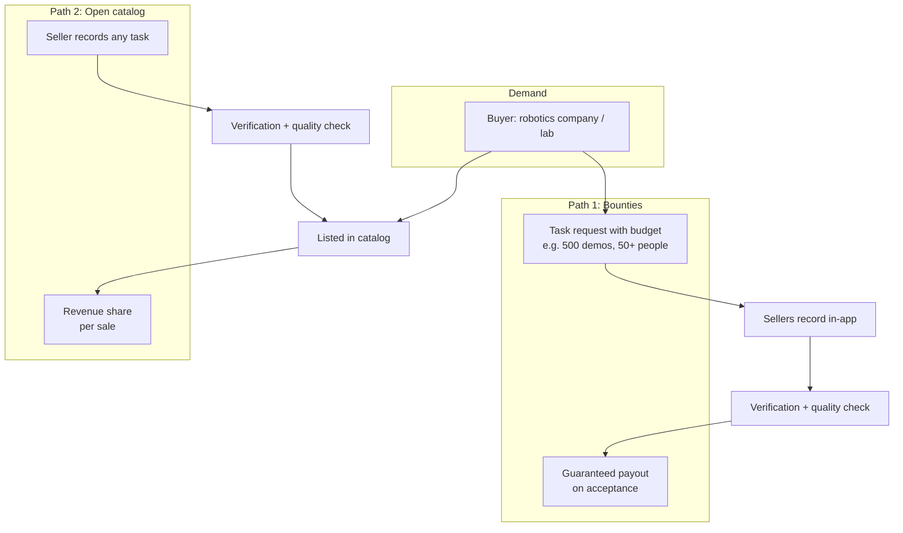

# Updated Breakdown: Demand-Driven Robot Training Data Marketplace

## One-liner

Companies request exactly the robot training data they need. Anyone with a phone can deliver it. Every recording is verifiably real through sensor data and live challenges, and quality is checked while you record, not after.

## What changed and why

| Problem | Old approach | New approach |
|---------|--------------|--------------|
| Thousands of hours of free household footage already exist | Sellers upload whatever they film | Buyers post specific task requests, supply follows demand into the long tail |
| We can't verify footage is real (AI-generated, YouTube re-uploads) | Upload from gallery | In-app recording only, with sensor data and challenge-response |
| Sellers have no guaranteed income | Payout per accepted upload | Hybrid: guaranteed bounties plus stock-style revenue share |

---

## 1. Positioning

Figure (Index), DoorDash, Instawork and others pay people to film tasks, but the data stays with one company. Open marketplaces like Luel and Kinetic Blocks exist, but rely on vetted suppliers and mostly deliver raw video.

Our combination nobody offers:

1. **Self-serve supply**: anyone can sign up and record, no recruiting or vetting
2. **Open demand**: any robotics company, startup or university lab can buy
3. **Phone only**: no headset, glove or pre-ordered hardware
4. **Robot-ready and verified**: hand poses, gripper trajectory, quality score and authenticity proof come with every recording

Pitch line: *"Figure can spend a billion dollars on its own data. The hundreds of other robotics startups and labs can't, and Figure shares nothing. We're the open market for everyone else."*

---

## 2. Business model: two paths



| | Bounties (requests) | Open catalog |
|---|---|---|
| Who starts it | Buyer posts request with budget | Seller records any task |
| Payout | Guaranteed once quality check passes | Revenue share every time it sells |
| Model | Freelance job | Stock footage (Shutterstock, Adobe Stock) |
| Role | Core business, predictable income | Long-tail catalog, passive income |

**Licensing**: non-exclusive by default, so one recording can sell to many buyers. Exclusive licenses at a premium.

**Why not pay-on-sale only**: sellers would film without knowing if they'll ever get paid, while competitors pay guaranteed hourly rates. A marketplace without supply is dead.

### What a good task request looks like

Robotics teams don't buy single videos. One window-cleaning video is worthless, 300 varied demos are valuable. Requests specify:

- Task: "replace SIM card in a smartphone", "trim hedge with electric shears"
- Volume: number of demos
- Diversity: minimum distinct people, environments, lighting conditions
- Perspective: egocentric / exocentric
- Optional: specific tools, objects or device models

---

## 3. Authenticity: making fakes impractical

**Core decision: no gallery uploads. Recording happens inside our web app only.** This blocks most fakes and gives us the tracking data from the session for free.

| Layer | How it works | Hackathon | Startup |
|-------|--------------|-----------|---------|
| Motion sensor sync | Accelerometer + gyroscope recorded in sync with video (`DeviceMotionEvent`). AI-generated or re-filmed videos have no physically consistent motion trace | ✅ | ✅ |
| Challenge-response | Random prompts during recording ("show 3 fingers now", hold a displayed code into frame). Impossible to pre-produce | ✅ | ✅ |
| Hand tracking stream | Live landmarks from the session must match the video | ✅ | ✅ |
| Duplicate detection | Perceptual hashing against known online footage and our own catalog | | ✅ |
| Payout holding period | Payout after e.g. 14 days, fraud detected in that window means no payout and account ban | shown in UI | ✅ |
| Device attestation | Apple App Attest / Android Play Integrity, C2PA content credentials | | ✅ |

---

## 4. Live quality feedback (our key differentiator)

Competitors check footage after upload and reject it. We give feedback **during** recording:

- The mirrored robot arm shows instantly if tracking is lost or jittery
- On-screen warnings: hands out of frame, too dark, too much motion blur
- Seller sees an estimated quality score before submitting

Result: less rejected footage, higher payouts for sellers, better data for buyers. The wow demo becomes a core product feature.

### Video-specific quality indicators

| Indicator | What it checks |
|-----------|----------------|
| Hand visibility | Share of frames with both hands tracked |
| Tracking confidence | Average landmark confidence, no sudden jumps |
| Image quality | Lighting, motion blur, stability |
| Task completion | VLM checks the requested task was actually completed |
| Request match | Footage matches the buyer's spec (tools, perspective, environment) |
| Authenticity | Sensor sync and challenge passed |
| Privacy | No unblurred faces, screens or license plates |

---

## 5. Privacy and consent

Open self-serve supply means less control, so trust has to be built into the product:

- **On-device anonymization**: faces, screens and license plates blurred in the browser before upload
- **Consent and license checkbox** at every submission: seller confirms they own the footage and grants the license
- **Workplace footage**: seller confirms permission when recording at an employer's site

---

## 6. Competitive landscape

| Company | What they do | Difference to us |
|---------|--------------|------------------|
| Figure Index | Gig platform, people film tasks | Data stays with Figure |
| DoorDash, Instawork, Sunain, Micro1 | Paid recording programs | Collect for specific clients, recruited workers |
| Scale AI, Encord | Data services and tooling | Enterprise, managed programs |
| Luel (YC W26) | Open marketplace, custom campaigns | Vetted contributors, mostly raw video |
| Kinetic Blocks | Humanoid data marketplace (beta) | Vetted suppliers only |
| Build AI | ~1M hours of free factory footage | Proves generic footage is a commodity |

Honest caveat: human demonstration data complements robot data, it doesn't replace it. We don't claim robots no longer need teleoperation.

---

## 7. Changes to the implementation plan

| Person | Change |
|--------|--------|
| A: Tracking | Add live quality warnings (hands lost, low confidence) |
| B: Robot + export | Record `DeviceMotionEvent` data in sync with video, add to episode JSON. Add challenge-response overlay during recording |
| C: Marketplace | Remove gallery upload. Add task request form for buyers (task, volume, diversity, budget) and bounty browser for sellers. Show payout holding period |
| D: Quality + pitch | Replace LLM-style indicators with video-specific ones above. Add authenticity check (sensor data present, challenge passed). Update pitch with new positioning |

### Episode format additions

```json
{
  "sensors": {
    "accel": [[t_ms, x, y, z]],
    "gyro": [[t_ms, alpha, beta, gamma]]
  },
  "challenges": [
    { "t_ms": 12400, "prompt": "show 3 fingers", "passed": true }
  ],
  "request_id": "uuid or null",
  "consent": { "owns_footage": true, "license": "non-exclusive", "timestamp": "ISO8601" }
}
```

---

## 8. Demo script

1. Buyer posts a request: "200 demos of replacing a SIM card"
2. Presenter picks up the bounty on their phone and starts recording
3. Robot arm mirrors live, a challenge appears ("show 3 fingers"), presenter completes it
4. Upload, verification and quality score happen on screen
5. Buyer sees the accepted demo, seller sees the guaranteed payout

One continuous story, from request to payment, in under three minutes.
